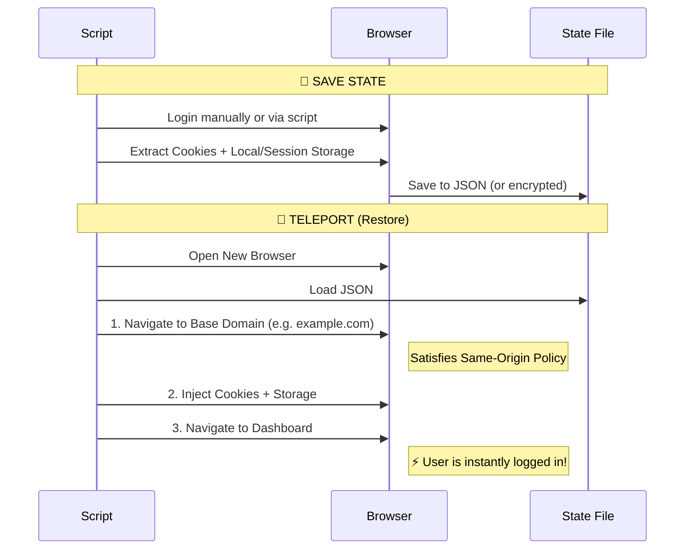

# 🚀 Selenium Teleport

**Save and restore browser state (Cookies, LocalStorage, SessionStorage) to instantly skip login screens.**

[](https://www.python.org/downloads/)
[](https://opensource.org/licenses/MIT)
[](https://pypi.org/project/selenium-teleport/)

## 🛑 The Problem

Automating checkouts or complex workflows is hard because **logging in every time is slow and triggers bot detection**.

Most developers try to save cookies, but it fails because:
1.  **Missing Data**: Modern sites use `LocalStorage` and `SessionStorage` for auth tokens, not just cookies.
2.  **Security Blocks**: Trying to inject cookies into a blank tab (`data:,`) fails due to the **Same-Origin Policy**. You can't set a cookie for `example.com` while you are on `about:blank`.
3.  **Bot Detection**: Repeated logins flag your IP/Account as suspicious.

## ✅ The Solution: Teleport

**Selenium Teleport** acts as a universal state bridge.
1.  **Captures Everything**: Saves Cookies, LocalStorage, and SessionStorage.
2.  **Bypasses Security**: Automatically navigates to the site's "Base Domain" first to satisfy the Same-Origin Policy.
3.  **Injects & Teleports**: Safely injects the state and "teleports" the browser to your destination URL, instantly authenticated.



## ✨ Features

### Core Features
- **Complete State Capture** - Cookies, LocalStorage, SessionStorage, IndexedDB info
- **Same-Origin Bypass** - Navigates to base domain before injection
- **Anti-Detection** - Built-in undetected-chromedriver integration
- **StealthBot Support** - Full integration with sb-stealth-wrapper v0.4.0+
- **Context Manager** - Auto-save on successful exit

### Security Features (v2.1.0)
- **🔐 State Encryption** - Encrypt state files using Fernet symmetric encryption
- **⏰ Token Expiry Validation** - Automatically detect and remove expired cookies
- **🌐 Domain Validation** - Prevent cross-domain state injection attacks
- **🛡️ Path Sanitization** - Prevent path traversal attacks
- **🚫 SSRF Protection** - Block requests to private/internal IPs

### Enterprise Features
- **Configuration Management** - Environment variables or config file based settings
- **Modular Architecture** - Clean separation of concerns for maintainability
- **Comprehensive Exceptions** - Detailed error hierarchy for proper handling
- **GDPR Compliance** - Secure state deletion functionality

## 📦 Installation

```bash
# Basic installation
pip install selenium-teleport

# With stealth mode (Cloudflare bypass)
pip install selenium-teleport[stealth]

# With encryption support
pip install selenium-teleport[security]

# Full installation (all features)
pip install selenium-teleport[stealth,security]
```

## 🏃 Quick Start

### Standard Mode

```python
from selenium_teleport import create_driver, Teleport

driver = create_driver(profile_path="my_profile")

with Teleport(driver, "session.json") as t:
    if t.has_state():
        t.load("https://example.com/dashboard")
    else:
        driver.get("https://example.com/login")
        # Login manually...

driver.quit()
```

### � With Encryption

```python
import os
from selenium_teleport import create_driver, Teleport, generate_key

# Generate a key once and store it securely
# key = generate_key()
# print(key)  # Save this!

# Set encryption key via environment variable
os.environ["TELEPORT_ENCRYPTION_KEY"] = "your-fernet-key-here"

driver = create_driver()

with Teleport(driver, "session.enc", encrypt=True) as t:
    if t.has_state():
        t.load("https://example.com/dashboard")
    else:
        driver.get("https://example.com/login")
        # Login...

driver.quit()
```

### 🛡️ Stealth Mode (sb-stealth-wrapper v0.4.0+)

For sites with bot detection (Cloudflare, DataDome, etc.):

```python
from sb_stealth_wrapper import StealthBot
from selenium_teleport import save_state_stealth, load_state_stealth
import os

# Use success_criteria to confirm page is fully loaded
with StealthBot(success_criteria="Dashboard") as bot:
    # Restore state if it exists
    if os.path.exists("state.json"):
        load_state_stealth(bot, "state.json", "https://example.com")
    else:
        bot.safe_get("https://example.com/login")
        # Login using bot.smart_click(), etc.
    
    # Save state for next time
    save_state_stealth(bot, "state.json")
```

Or use `create_driver` with stealth mode:

```python
from selenium_teleport import create_driver, save_state_stealth, load_state_stealth

with create_driver(use_stealth_wrapper=True, success_criteria="Welcome") as bot:
    bot.safe_get("https://example.com")
    # Your automation code...
```

## 📖 API Reference

### State Management

| Function | Description |
|----------|-------------|
| `save_state(driver, file_path, encrypt=False)` | Save Cookies, LocalStorage, SessionStorage to JSON |
| `load_state(driver, file_path, url, validate_expiry=True, validate_domain=True)` | Load state and navigate to URL with validation |
| `delete_state(file_path, secure=True)` | Securely delete state file (GDPR compliance) |
| `get_state_info(file_path)` | Get metadata about a state file |

### Stealth Mode (sb-stealth-wrapper)

| Function | Description |
|----------|-------------|
| `save_state_stealth(bot, file_path, encrypt=False)` | Save state using bot.sb methods |
| `load_state_stealth(bot, file_path, url, validate_expiry=True)` | Load state and navigate using bot.sb |

### Context Managers

| Class/Function | Description |
|----------------|-------------|
| `Teleport(driver, file_path, auto_save=True, encrypt=False)` | Context manager with auto-save |
| `teleport_session(driver, file_path, destination_url=None)` | Functional context manager |

### Security Functions

| Function | Description |
|----------|-------------|
| `generate_key()` | Generate a new Fernet encryption key |
| `encrypt_state(state, key)` | Encrypt a state dictionary |
| `decrypt_state(data, key)` | Decrypt encrypted state data |
| `validate_domain_match(state_domain, target_url)` | Check if domains match |
| `remove_expired_cookies(cookies)` | Filter out expired cookies |

### Configuration

| Function | Description |
|----------|-------------|
| `TeleportConfig` | Configuration dataclass |
| `get_config()` | Get global configuration |
| `set_config(config)` | Set global configuration |

### `create_driver()` Parameters

| Parameter | Default | Description |
|-----------|---------|-------------|
| `profile_path` | `"selenium_profile"` | Browser profile location |
| `headless` | `False` | Headless mode (not recommended for stealth) |
| `browser` | `"chrome"` | Browser to use (`"chrome"` or `"edge"`) |
| `use_undetected` | `True` | Use undetected-chromedriver |
| `use_stealth_wrapper` | `False` | Use sb-stealth-wrapper |
| `success_criteria` | `None` | (Stealth) Text confirming page is loaded |
| `proxy` | `None` | (Stealth) Proxy in format `user:pass@host:port` |

## ⚙️ Configuration

### Environment Variables

| Variable | Description |
|----------|-------------|
| `TELEPORT_ENCRYPTION_KEY` | Fernet encryption key (enables encryption) |
| `TELEPORT_VALIDATE_EXPIRY` | `"true"` or `"false"` to validate cookie expiry |
| `TELEPORT_VALIDATE_DOMAIN` | `"true"` or `"false"` to validate domain match |
| `TELEPORT_LOG_LEVEL` | `DEBUG`, `INFO`, `WARNING`, `ERROR` |
| `TELEPORT_ALLOWED_DOMAINS` | Comma-separated whitelist of domains |

### Programmatic Configuration

```python
from selenium_teleport import TeleportConfig, set_config

config = TeleportConfig(
    encryption_enabled=True,
    encryption_key="your-key-here",
    validate_expiry=True,
    validate_domain=True,
    log_level="INFO",
)
set_config(config)
```

## 🚨 Exception Handling

```python
from selenium_teleport import (
    TeleportError,           # Base exception
    SecurityError,           # Security violations
    DomainMismatchError,     # State domain doesn't match target
    PathTraversalError,      # Path traversal attack detected
    SSRFError,               # SSRF attack detected
    EncryptionError,         # Encryption/decryption failed
    StateError,              # State file issues
    StateFileNotFoundError,  # State file doesn't exist
    InvalidStateError,       # Invalid state file format
    ExpiredSessionError,     # All cookies expired
    DriverError,             # Driver creation issues
)

try:
    load_state(driver, "state.json", "https://example.com")
except DomainMismatchError as e:
    print(f"Security: {e.message}")
except ExpiredSessionError:
    print("Session expired, need to re-login")
except StateFileNotFoundError:
    print("No saved state, performing fresh login")
```

## ⚠️ Important Notes

1. **Standard mode**: Uses `driver.get_cookies()` / `driver.execute_script()`
2. **Stealth mode**: Uses `bot.sb` methods which maintain stable connection after challenge handling
3. **Session persistence varies by site** - Some sites use complex auth beyond cookies
4. **Encryption requires the `cryptography` package** - Install with `pip install selenium-teleport[security]`
5. **State files contain sensitive tokens** - Always use `.gitignore` to exclude them

## 🧪 Tested Sites

- ✅ Hacker News
- ✅ Reddit
- ✅ Gmail (with persistent profile)
- ✅ Various Cloudflare-protected sites (stealth mode)

## 📁 Project Structure

```
selenium_teleport/
├── __init__.py      # Public API
├── drivers.py       # Driver creation
├── state.py         # State save/load
├── stealth.py       # StealthBot integration
├── context.py       # Context managers
├── security.py      # Encryption & validation
├── config.py        # Configuration
├── cookies.py       # Cookie utilities
├── storage.py       # Storage extraction
├── utils.py         # URL helpers
└── exceptions.py    # Exception hierarchy
```

## 👨‍💻 Author

**Dhiraj Das** - [dhirajdas.dev](https://www.dhirajdas.dev)

## 📄 License

MIT License - see [LICENSE](LICENSE) for details.
